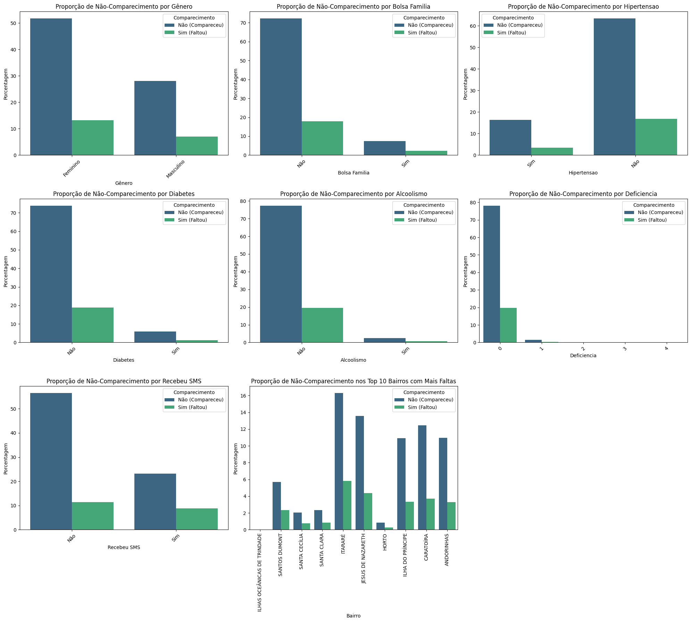
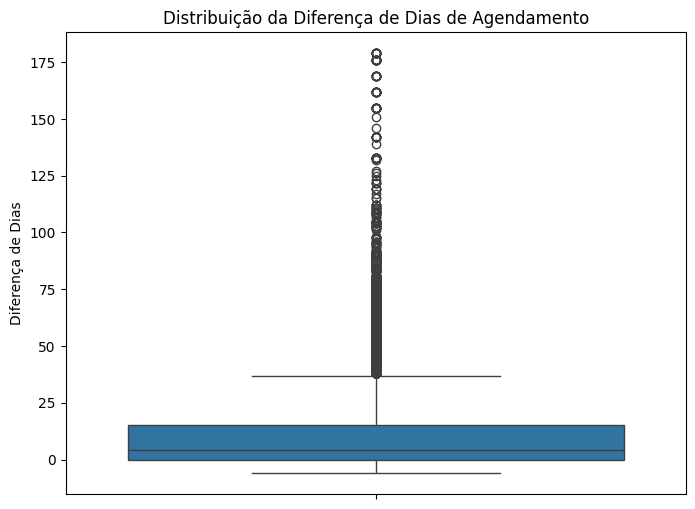
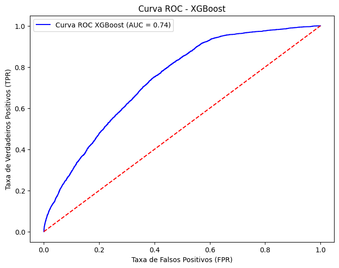
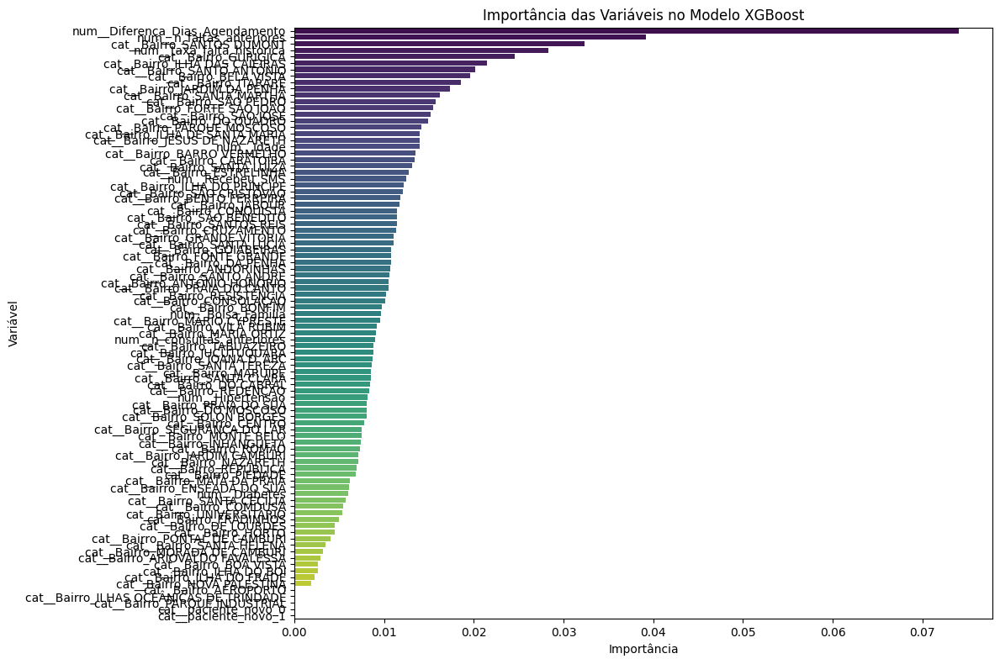

# Previsão de Não Comparecimento em Consultas Médicas (No-Show)


Projeto de ciência de dados que analisa e prevê o não comparecimento de
pacientes a consultas médicas agendadas, utilizando o dataset público
**Medical Appointment No Shows** (Kaggle). O objetivo prático é identificar
antecipadamente pacientes com alta probabilidade de faltar, permitindo
intervenções (lembretes, ligações, remarcação proativa) que reduzam o
desperdício de tempo e recursos de médicos e clínicas.

## Fonte dos dados

- Dataset: [Medical Appointment No Shows](https://www.kaggle.com/datasets/joniarroba/noshowappointments) (Kaggle)
- 110.527 consultas médicas agendadas em Vitória/ES, Brasil (2016)
- 14 variáveis originais: idade, gênero, bairro, comorbidades (hipertensão,
  diabetes, alcoolismo), deficiência, bolsa família, recebimento de SMS,
  datas de agendamento/consulta, e a variável-alvo (`No-show`)

## Estrutura do notebook (`No_Show_Appointments.ipynb`)

O notebook segue um fluxo completo de ciência de dados, em 7 etapas:

### 1. Leitura da base e bibliotecas
Carregamento com `pandas`, `numpy`, `matplotlib`, `seaborn` e `plotly`.

### 2. Verificação de valores faltantes e tipos de dados
Checagem de nulos e dtypes de cada coluna.

### 3. EDA — Análise Exploratória
- Estatísticas descritivas das variáveis numéricas
- **Identificação e remoção de 1 registro com idade negativa** (erro de
  digitação conhecido no dataset original)
- Renomeação das colunas para nomes em português, facilitando leitura
- Visualização da proporção de cada variável categórica
- Proporção de não comparecimento por variável categórica
- Boxplot da distribuição de idade



Alguns padrões que já aparecem nessa etapa exploratória: pacientes com
hipertensão ou diabetes faltam proporcionalmente menos, enquanto quem
recebeu SMS aparenta faltar *mais* (efeito de confusão explicado na seção
de feature engineering: SMS só é enviado quando há bastante antecedência,
e é a antecedência, não o SMS, que aumenta a chance de falta). O bairro
também mostra variação relevante na taxa de não comparecimento.

### 4. Feature Engineering
Três novas variáveis foram criadas a partir dos dados brutos:

| Feature criada | Lógica |
|---|---|
| `Diferenca_Dias_Agendamento` | Diferença em dias entre a data do agendamento e a data da consulta (usando `.dt.normalize()` para desconsiderar o horário, já que `AppointmentDay` não tem componente de hora) |
| `n_consultas_anteriores` | Nº de consultas anteriores do paciente (via `groupby('ID_Paciente').cumcount()`, ordenado cronologicamente — sem vazamento de dados do futuro) |
| `n_faltas_anteriores` | Nº de faltas anteriores do paciente (`cumsum().shift(1)`, garantindo que só o histórico *antes* da consulta atual é considerado) |
| `taxa_falta_historica` | `n_faltas_anteriores / n_consultas_anteriores`, com tratamento de divisão por zero para pacientes novos |
| `paciente_novo` | Flag binária: 1 se é a primeira consulta do paciente na base |



Essa é, adiante, a variável que se mostra mais importante em todos os
modelos testados — vale observar a cauda longa de pacientes que agendam
com muita antecedência.

### 5. Análise Estatística — Testes de Hipótese

**Teste Qui-Quadrado** (variáveis categóricas vs. `Nao_Comparecimento_consulta`):

| Variável | Qui-Quadrado | p-valor | Significativa? |
|---|---|---|---|
| Bolsa_Familia | 93,57 | < 0.0001 | ✅ Sim |
| Hipertensao | 140,67 | < 0.0001 | ✅ Sim |
| Diabetes | 25,33 | < 0.0001 | ✅ Sim |
| Recebeu_SMS | 1765,98 | < 0.0001 | ✅ Sim |
| paciente_novo | 85,39 | < 0.0001 | ✅ Sim |
| Bairro (top 10) | 204,21 | < 0.0001 | ✅ Sim |
| Genero | 1,86 | 0,173 | ❌ Não |
| Alcoolismo | 0,002 | 0,965 | ❌ Não |
| Deficiencia | 7,04 | 0,134 | ❌ Não |

**Teste t de Student** (Idade vs. `Nao_Comparecimento_consulta`):
- Idade média de quem compareceu: **37,79 anos**
- Idade média de quem faltou: **34,32 anos**
- t = 20,83, p < 0.0001 → diferença estatisticamente significativa
  (pacientes mais jovens faltam mais)

**Decisão de modelagem:** com base nos testes acima, `Genero`, `Alcoolismo`
e `Deficiencia` foram removidas do conjunto de features para a Regressão
Logística, por não apresentarem relação estatisticamente significativa com
o não comparecimento.

### 6. Treinamento e Comparação de Modelos

Todos os modelos usam o mesmo pipeline de pré-processamento
(`ColumnTransformer` com `StandardScaler` para numéricas e `OneHotEncoder`
para categóricas) e a mesma divisão treino/teste (80/20, estratificada),
para garantir comparação justa.

| Modelo | Acurácia | Precisão | Recall | F1-Score | AUC-ROC |
|---|---|---|---|---|---|
| Regressão Logística | 0,6604 | 0,3184 | 0,5977 | 0,4154 | 0,6862 |
| Random Forest | 0,7666 | 0,3683 | 0,2177 | 0,2737 | 0,6890 |
| **XGBoost** | 0,6167 | 0,3162 | **0,7728** | 0,4488 | **0,7391** |



**Principais conclusões da comparação:**
- A **Regressão Logística** serviu de baseline interpretável, com
  desempenho equilibrado mas moderado.
- O **Random Forest** melhorou a precisão, mas ao custo de uma queda
  drástica no recall (perde ~78% dos pacientes que realmente faltam) —
  inadequado para o objetivo de negócio de identificar a maioria dos
  faltantes.
- O **XGBoost** foi escolhido como modelo final: tem o maior Recall
  (77,28%) e o maior AUC-ROC (0,7391) entre os três, priorizando a
  identificação de pacientes que realmente faltarão — o mais alinhado ao
  objetivo de reduzir o desperdício de tempo/recursos médicos, mesmo com
  uma precisão ainda moderada (31,62%).

### 6.3.2 Importância das Variáveis (XGBoost)

Top 5 variáveis mais importantes para o modelo final:

1. `Diferenca_Dias_Agendamento` — tempo entre agendamento e consulta
2. `n_faltas_anteriores` — histórico de faltas do paciente
3. `Bairro` (destaque para SANTOS DUMONT, GURIGICA, entre outros) — localização geográfica
4. `taxa_falta_historica` — taxa histórica de falta do paciente
5. `Idade`



### 7. Conclusão e Próximos Passos

O notebook aponta como próximos passos recomendados:
1. **Engenharia de features focada**: categorizar `Diferenca_Dias_Agendamento`
   em faixas, e investigar mais a fundo os bairros com maior taxa de falta
2. **Validação cruzada**: avaliar o modelo com cross-validation para uma
   estimativa mais robusta de generalização
3. **Análise de custo-benefício**: quantificar, junto a especialistas da
   área, o custo de um falso positivo (intervenção desnecessária) vs. um
   falso negativo (falta não prevenida), para calibrar o limiar de decisão
   ideal

## Stack utilizado

`pandas`, `numpy`, `matplotlib`, `seaborn`, `plotly`, `scipy` (testes
estatísticos), `scikit-learn` (pipeline, pré-processamento, Regressão
Logística, Random Forest, métricas), `xgboost`.

## Como rodar

O notebook foi desenvolvido no Google Colab e carrega o dataset a partir do
Google Drive:

```python
data_nsa = pd.read_csv("/content/drive/MyDrive/Colab Notebooks/falta_consultas-may-2016.csv")
```

Para rodar localmente (fora do Colab), ajuste essa linha para o caminho
relativo do dataset incluído neste repositório:

```python
data_nsa = pd.read_csv("dados/noshowappointments-kagglev2-may-2016.csv")
```

Instale as dependências:

```bash
pip install pandas numpy matplotlib seaborn plotly scipy scikit-learn xgboost
```

E rode as células do notebook em ordem, com Jupyter ou VS Code.

## Estrutura do repositório

```
.
├── No_Show_Appointments.ipynb          # notebook principal com toda a análise
├── dados/
│   └── noshowappointments-kagglev2-may-2016.csv
├── graficos/                            # imagens usadas neste README
└── README.md
```

## Autor

**Everson Cardozo Machado**
Cientista de Dados com experiência em Analytics, Machine Learning, People
Analytics, Business Intelligence e desenvolvimento de soluções orientadas
a dados.
